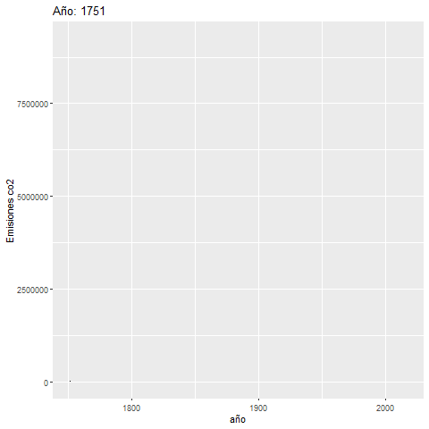
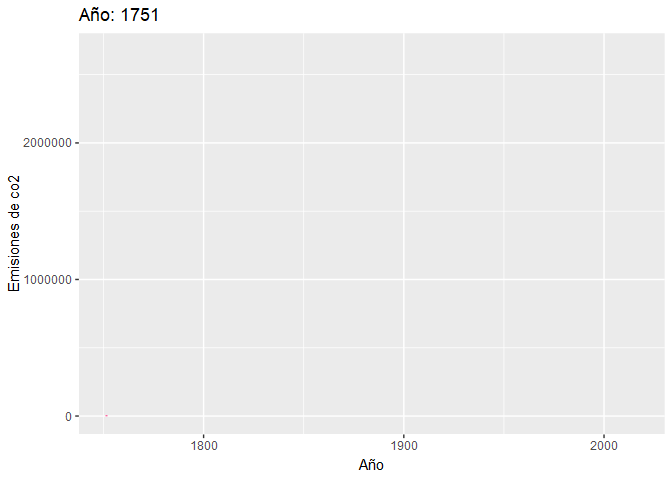
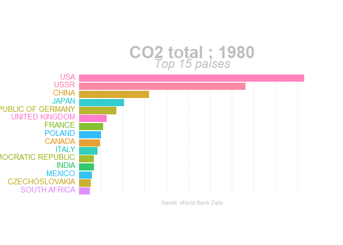
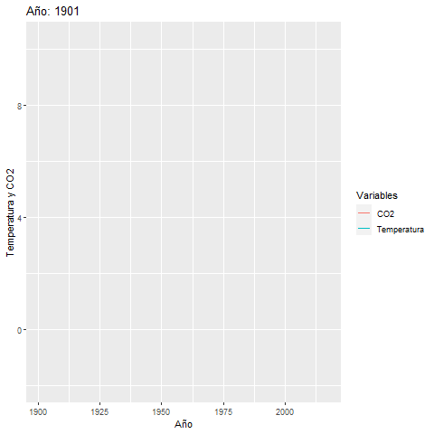
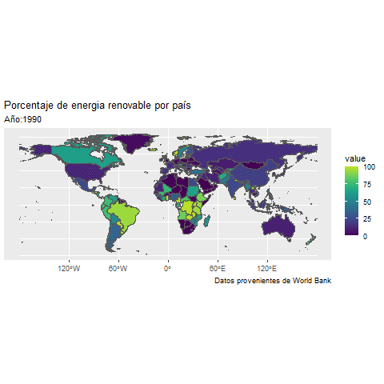
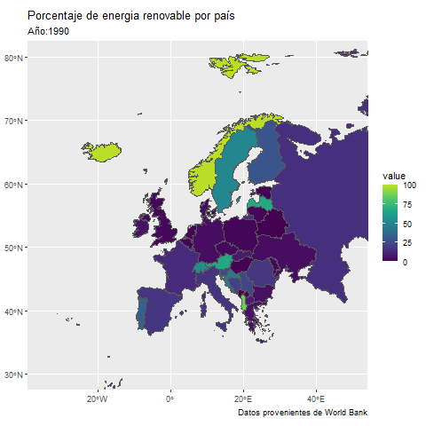

```{r packages-setup, include = FALSE}
library(tidyverse)
library(klippy)  #- remotes::install_github("rlesur/klippy")
library(knitr)
```

```{css, echo = FALSE}
.columns {display:flex;}
h1.title {font-size: 45px;color: forestgreen}
h1 {color: Seagreen; font-size: 35px ;font-family: Arial, Helvetica, sans-serif}
h2{color: Darkolivegreen; font-size: 28px;}
body { background-color: darkseagreen; }
a {color: green;}
.list-group-item.active, .list-group-item.active:focus, .list-group-item.active:hover {
    z-index: 2;
    color: #fff;
    background-color: olivedrab;
    border-color: palegreen;
}
.nav-pills > li.active > a, .nav-pills > li.active > a:hover, .nav-pills > li.active > a:focus {
    color:black;
    background-color: olivedrab;
}
body{
   font-family: "Lucida Console",monospace;
  font-size: 11pt;
}
```

```{r chunk-setup, include = FALSE}
knitr::opts_chunk$set(echo = TRUE, eval = TRUE, message = FALSE, warning = FALSE, 
                      #results = "hold",
                      cache = FALSE, cache.path = "/caches/", comment = "#>",
                      #fig.width = 7, #fig.height= 7,   
                      #out.width = 7, out.height = 7,
                      collapse = TRUE,  fig.show = "hold",
                      fig.asp = 7/9, out.width = "60%", fig.align = "center")
#- para mejorar los gráficos, bueno en realidad para que se vean igual en distintos SO
#- https://www.jumpingrivers.com/blog/r-knitr-markdown-png-pdf-graphics/
knitr::opts_chunk$set(dev = "png", dev.args = list(type = "cairo-png"))
```

```{r options-setup, include = FALSE}
options(scipen = 999) #- para quitar la notación científica
options("yaml.eval.expr" = TRUE) 
```


```{r klippy, echo = FALSE}
klippy::klippy(position = c("top", "right")) #- remotes::install_github("rlesur/klippy")
```

-----------------

Trabajo  elaborado para la asignatura "Programación y manejo de datos en la era del Big Data" de la Universitat de València durante el curso 2020-2021. La página web de la asignatura puede verse aquí: <https://perezp44.github.io/intro-ds-20-21-web/>. Los trabajos de mis compañeros de curso pueden verse [aquí](https://perezp44.github.io/intro-ds-20-21-web/07-trabajos.html).

---------------

<br>

# Introducción {.tabset .tabset-pills}

## Objetivos

El objetivo de este trabajo es mostrar la evolución y el impacto de algunas variables medioambientales relevantes (las emisiones del CO2, estudiaremos su evolución así como las principales causas de sus aumentos y que países son los principales responsables) y ver el impacto negativo que provoca a nivel medioambiental en el mundo y como esto nos afecta (incrementos de temperatura). También veremos brevemente la evolución de las energias renovables a nivel mundial.

## Fuente de los datos

Los datos utilizados provienen del [Banco Mundial ](https://datos.bancomundial.org/) 

## Primeros pasos

Primero importamos las librerias básicas, utilizamos más librerias pero las llamamos cuando las necesitamos. Les remito al `sessionInfo()` para ver todos los paquetes utilizados.

```{r library_setup}
library(tidyverse) 
library(sf)
library(viridis) #- install.packages("viridis")
library(plotly)
library(gganimate)
library(transformr) #-install.packages("transformr")
library(wordcloud2) #- install.packages("wordcloud2")
library(janitor)
```

Una vez cargados los paquetes que vamos a utilizar, procedemos a importar los datos que vamos a utilizar

```{r df_base}

df_co2<- read_csv("./Datos/nation_1751_2017.csv")
temp_country <-read_csv("./Datos/GlobalLandTemperaturesByCountry.csv")
coast_vs_waste <- read_csv("https://raw.githubusercontent.com/rfordatascience/tidytuesday/master/data/2019/2019-05-21/coastal-population-vs-mismanaged-plastic.csv")

mismanaged_vs_gdp <- read_csv("https://raw.githubusercontent.com/rfordatascience/tidytuesday/master/data/2019/2019-05-21/per-capita-mismanaged-plastic-waste-vs-gdp-per-capita.csv")

waste_vs_gdp <- read_csv("https://raw.githubusercontent.com/rfordatascience/tidytuesday/master/data/2019/2019-05-21/per-capita-plastic-waste-vs-gdp-per-capita.csv")
dco2_pc<- read_csv("./Datos/co2_pc.csv")
```


# Emisiones de co2, diferentes perspectivas.


```{r }
#Limpiamos el df y ponemos las variables como numericas
df_co2_2 <- df_co2[-c(1:4), ]
df_co2_2[ df_co2_2 == "." ] <- NA
 df_co2_3 <-  transform(df_co2_2, X2 = as.numeric(X2),
   X3 = as.numeric(X3),
   X4 = as.numeric(X4),
   X5 = as.numeric(X5),
   X6 = as.numeric(X6),
   X7 = as.numeric(X7),
   X8 = as.numeric(X8),
   X9 = as.numeric(X9),          
   X10 = as.numeric(X10)      
 )
 #comprobamos que las variables del df3 estan correctas
 str(df_co2_3)
 #renombramos las variables para trabajar de manera mas cómoda
             
df_co2_4 <- df_co2_3 %>% rename(country = `Carbon.Dioxide.emissions.from.fossil.fuel.consumption.and.cement.production.by.nation`,
  year = X2,
   total_co2 = X3 #`Total CO2 emissions from fossil-fuels and cement production (thousand metric tons of C)`
   ,
em_sf = X4, #`Emissions from solid fuel consumption` 
em_lf = X5, #`Emissions from liquid fuel consumption` 
em_gf = X6, #`Emissions from gas fuel consumption` 
em_cp = X7, #`Emissions from cement production` ,
em_gfl = X8, #`Emissions from gas flaring`
em_co2_pc = X9, #`Per capita CO2 emissions (metric tons of carbon)`
em_bf = X10 #`Emissions from bunker fuels`
)
#creamos los diferentes df modificados que vamos a usar 
 n_df_0 <- df_co2_4%>% select(year,country,total_co2)%>%  filter(year==2010) %>% group_by(country)%>% select(-year) %>% arrange(total_co2)
  n_df <- df_co2_4 %>% group_by(country) %>% summarise(total_co2=sum(total_co2))%>% ungroup() %>% slice_max(total_co2,n=20) %>% arrange(desc(total_co2))
  n_df2 <- df_co2_4 %>% filter(year > 2000) %>% group_by(country) %>% summarise(em_co2_pc=sum(em_co2_pc))%>% ungroup() %>% slice_max(em_co2_pc,n=40) %>% arrange(desc(em_co2_pc))
  w_df <- df_co2_4 %>% group_by(year) %>% summarise(n=sum(total_co2))%>% ungroup()

```

## La evolución de las emisiones de co2 {.tabset .tabset-pills}

En primer lugar estudiamos la evolución de las emisiones de CO2, los motivos por los que han ido aumentando desde el siglo XIX y sus causas.

Observamos en el gráfico el crecimiento exponencial de las emisiones de CO2 durante el siglo XX y XXI. El crecimiento de las emisiones empieza en la década de 1850, con la Primera Revolución Industrial y la expansión de este acontecimiento por el resto de Europa, ya que la maquinaria creada durante este proceso utilizaba combustibles contaminantes como diversos tipos de carbón. Sin embargo, no es hasta finales del siglo XIX con la Segunda Revolución Industrial que el crecimiento se vuelve exponencial con Estados Unidos a la cabeza como máximo emisor de CO2. Este crecimiento se mantiene hasta el cuarto final del siglo XX, debido a la inclusión de varias innovaciones como los fertilizantes de nitrógeno, varios usos de gases fluorados, tala de selvas tropicales, etc. Después el crecimiento en emisiones se ralentiza (pero continua creciendo aunque a un ritmo mas decelerado) para continuar con el crecimiento exponencial desde principios del siglo XXI, donde China superaría a Estados Unidos como principal emisor.

### Gráfico
```{r,echo = FALSE}
smoothScatter(w_df,ylab = "Em.Co2", xlab = "Año")

```

### Tabla

```{r, echo = FALSE, eval = TRUE, results = TRUE}
tabla1 <- w_df %>% filter(year %in% c(1800, 1850, 1900, 1950, 1975, 2000))%>%   arrange( desc(n)) %>% rename("Año" = year, "Emisiones de co2" = n)  
knitr::kable(tabla1)

```

### Gráfico Animado



### Código
```{r co2_gf2, message = FALSE, warning = FALSE, eval = FALSE}

  #primer Gráfico
smoothScatter(w_df,ylab = "Em.Co2", xlab = "Año")


#Grafico animado

  o<-  w_df %>% ggplot() +
     geom_line(aes(year,n)) 

 ooo<- o +  transition_reveal(year) +
    labs(title = "Año: {as.integer(frame_along)}", y = "Emisiones co2", x = "año")
  anim_save("./imagenes/ooo.gif", ooo)
  
tabla1 <- w_df %>% filter(year %in% c(1800, 1850, 1900, 1950, 1975, 2000))
knitr::kable(tabla1)
   

```


 
## La evolución de las emisiones de CO2 por país {.tabset .tabset-pills}

Observamos que las emisiones de CO2 empiezan a crecer a partir de 1850, con la **Primera Revolución Industrial** que introdujo, entre otras cosas, el uso del carbón como combustible y fuente de energia. Reino Unido se mantiene líder en emisiones de CO2 desde 1850 a 1890, debido a que es el lugar donde empieza la Primera Revolución Industrial y por lo tanto, el país con maquinaria más contaminante en ese momento. Se observa en 1890 un cambio, Estados Unidos pasa a ser el país más contaminante coincidiendo con su paso a Reino Unido como primera potencia mundial debido a la **Segunda Revolución Industrial**, en la que Reino Unido se queda atrás por el alto coste de oportunidad de cambiar la maquinaria antigua de la Primera Revolución por la mas moderna de la Segunda. Estados Unidos lidera en emisiones de CO2 desde este momento y durante todo el siglo XX hasta 2006, momento en que es superado por China como país con más emisiones. 

Por lo tanto distinguimos 4 etapas diferenciadas en la tabla a continuación: \n 

+ Primera etapa: previa a la Revolución Industrial, donde no había apenas emisión de estos gases. \n

+ Segunda etapa: durante la primera Revolución Industrial y hasta 1890, donde Reino Unido lidera en emisiones debido a los carbones que se utilizaban en la maquinaria innovada durante esta época.\n

+ Tercera etapa: que abarca desde 1890 hasta 2005, donde Estados Unidos es el principal emisor de CO2 debido a la Segunda Revolución Industrial, a los varios inventos producidos durante el siglo XX (fertilizantes, ) y a la deforestación. \n

+ Cuarta etapa: donde China sobrepasa a Estados Unidos como principal emisor de CO2 en términos absolutos.


### Gráficos 

Gráfico 2



### Tabla

```{r, echo = FALSE, eval = TRUE, results = TRUE}
tabla2 <- df_co2_4 %>% select(year, country, total_co2) %>% filter(year %in% c(1850, 1889, 1890, 2005, 2006)) %>% group_by(year) %>% slice_max(total_co2) %>%  rename("Año" = year, "País" = country,"Emisiones de co2" =total_co2) 

knitr::kable(tabla2)

```


### Código

```{r co2_gf1, message = FALSE, warning = FALSE, results = FALSE}
df_co2_5 <-df_co2_4 %>% group_by(country)
 n_df_0 <- df_co2_4%>% select(year,country,total_co2)%>%  filter(year==2010) %>% group_by(country)%>% select(-year) %>% arrange(total_co2)
  n_df <- df_co2_4 %>% group_by(country) %>% summarise(total_co2=sum(total_co2))%>% ungroup() %>% slice_max(total_co2,n=20) %>% arrange(desc(total_co2))
  n_df_2 <- df_co2_4 %>% filter(year > 2000) %>% group_by(country) %>% summarise(em_co2_pc=sum(em_co2_pc))%>% ungroup() %>% slice_max(em_co2_pc,n=15) %>% arrange(desc(em_co2_pc))
 
   
  n_df_3 <- df_co2_4%>% group_by(country) %>% summarise(em_co2_pc=sum(em_co2_pc))%>% ungroup()  %>% arrange(desc(em_co2_pc))
 
  lf <- df_co2_5%>% filter(year >= 1980)  %>% group_by(year) %>%
  
  mutate(rank = rank(-total_co2),
         Value_rel = total_co2/total_co2[rank==1],
         Value_lbl = paste0(" ",round(total_co2/1e9))) %>%
  group_by(country) %>% 
  filter(rank <=15) %>%
  ungroup()
  
  lf$country <- recode(lf$country, 
                          "UNITED STATES OF AMERICA"="USA",
        "CHINA (MAINLAND)"="CHINA",
        "FRANCE (INCLUDING MONACO)"="FRANCE",
        "ITALY (INCLUDING SAN MARINO)"="ITALY",
        "RUSSIAN FEDERATION" = "RUSSIA"
        
        )
   
  

   
   staticplot = ggplot(lf, aes(rank, group = country, 
                fill = as.factor(country), color = as.factor(country))) +
  geom_tile(aes(y = total_co2/2,
                height = total_co2,
                width = 0.9), alpha = 0.8, color = NA) +
  geom_text(aes(y = 0, label = paste(country, " ")), vjust = 0.2, hjust = 1) +
  #geom_text(aes(y=total_co2,label = Value_lbl, hjust=0)) +
  coord_flip(clip = "off", expand = FALSE) +
  scale_y_continuous(labels = scales::comma) +
  scale_x_reverse() +
  guides(color = FALSE, fill = FALSE) +
  theme(axis.line=element_blank(),
        axis.text.x=element_blank(),
        axis.text.y=element_blank(),
        axis.ticks=element_blank(),
        axis.title.x=element_blank(),
         axis.title.y=element_blank(),
        legend.position="none",
        panel.background=element_blank(),
        panel.border=element_blank(),
        panel.grid.major=element_blank(),
        panel.grid.minor=element_blank(),
        panel.grid.major.x = element_line( size=.1, color="grey" ),
        panel.grid.minor.x = element_line( size=.1, color="grey" ),
        plot.title=element_text(size=25, hjust=0.5, face="bold", colour="grey", vjust=-1),
        plot.subtitle=element_text(size=18, hjust=0.5, face="italic", color="grey"),
        plot.caption =element_text(size=8, hjust=0.5, face="italic", color="grey"),
        plot.background=element_blank(),
       plot.margin = margin(2,2, 2, 4, "cm"))
   anim = staticplot + transition_states(year, transition_length = 4, state_length = 1) +
  view_follow(fixed_x = TRUE)  +
  labs(title = 'CO2 total : {closest_state}',  
       subtitle  =  "Top 15 países",
       caption  = "fuente: World Bank Data")
 
  
   anim_save("./imagenes/anim.gif", anim)
  
    
  g<-  df_co2_5 %>% ggplot() +
    geom_line(aes(year,total_co2 ,color = country,group=country) ) +
      theme(legend.position="none")
  
  
  goo <- g +  transition_reveal(year) +
    labs(title = "Año: {as.integer(frame_along)}", x = "Año", y ="Emisiones de co2")
  anim_save("./imagenes/goo.gif", goo)
  
tabla2 <- df_co2_4 %>% select(year, country, total_co2) %>% filter(year %in% c(1850, 1889, 1890, 2005, 2006)) %>% group_by(year) %>% slice_max(total_co2) %>%  rename("Año" = year, "País" = country,"Emisiones de co2" =total_co2) 

knitr::kable(tabla2)

```


## CO2 per cápita {.tabset .tabset-pills}

Pasamos a visualizar los datos con un gráfico circular, donde podemos ver los mayores emisores desde el año 2000 de dióxido de carbono per cápita. 

Destacamos que los primeros paises en emisiones de dióxido de carbono per cápita utilizan como fuente de energia principal el petróleo (Qatar, Kuwait, Emiratos Árabes Unidos, Bahrein...) a la vez que también lo exportan debido a las grandes reservas del mismo. Estados Unidos aparece en la posición novena y China, el mayor emisor de CO2 en términos absolutos, no aparece entre los 40 primeros.

### Gráfico
 
```{r co2_gf4, message = FALSE, warning = FALSE, results = TRUE,echo = FALSE , eval = TRUE,fig.height = 4, fig.width = 6, fig.align = "center",dpi = 200}
  #Grafico circular paises con mayor prod. co2 per capita


 n_df3 <- n_df2 %>% mutate(id = seq(1,40))
label_data <- n_df3

number_of_bar <- nrow(label_data)
angle <-  90 - 360 * (label_data$id-0.5) /number_of_bar     
 

label_data$hjust<-ifelse( angle < -90, 1, 0)
 

label_data$angle<-ifelse(angle < -90, angle+180, angle)


p <- ggplot(n_df3, aes(x=as.factor(id), y=em_co2_pc,fill=em_co2_pc)) +       
 
   geom_bar(stat="identity") +
  
  ylim(-100,400) +
  
  theme_minimal() +
  theme(
    axis.text = element_blank(),
    axis.title = element_blank(),
    panel.grid = element_blank(),
    plot.margin = unit(rep(-1,4), "cm")      
  ) +
  
  
  coord_polar(start = 0) +
  
  
  geom_text(data=label_data, aes(x=id, y=em_co2_pc, label=country, hjust=hjust), color="black", fontface="bold",alpha=0.6, size=2.5, angle= label_data$angle, inherit.aes = FALSE ) +
  scale_fill_viridis_c(option = "B", trans = "sqrt") +
  labs(title = "Países con mayores emisiones de co2 per cápita", y = "Emisiones de co2 per cápita")
 
p


```

### Tabla

```{r, echo = FALSE , eval = TRUE}
tabla3 <- n_df3 %>% select(country, em_co2_pc) %>% slice_max(em_co2_pc, n = 10)
knitr::kable(tabla3)
```
 
### Código
```{r co2_gf3,echo = TRUE , eval = FALSE }


 n_df3 <- n_df2 %>% mutate(id = seq(1,40))
label_data <- n_df3

number_of_bar <- nrow(label_data)
angle <-  90 - 360 * (label_data$id-0.5) /number_of_bar     
 

label_data$hjust<-ifelse( angle < -90, 1, 0)
 

label_data$angle<-ifelse(angle < -90, angle+180, angle)


p <- ggplot(n_df3, aes(x=as.factor(id), y=em_co2_pc,fill=em_co2_pc)) +       

  geom_bar(stat="identity") +
  
 
  ylim(-100,400) +
  

  theme_minimal() +
  theme(
    axis.text = element_blank(),
    axis.title = element_blank(),
    panel.grid = element_blank(),
    plot.margin = unit(rep(-1,4), "cm")      
  ) +
  
  coord_polar(start = 0) +
  
  
  geom_text(data=label_data, aes(x=id, y=em_co2_pc, label=country, hjust=hjust), color="black", fontface="bold",alpha=0.6, size=2.5, angle= label_data$angle, inherit.aes = FALSE ) +
  scale_fill_viridis_c(option = "B", trans = "sqrt")
 
p

tabla3 <- n_df3 %>% slice_max(em_co2_pc, n = 10)
knitr::kable(tabla3)

```


## Mayores productores de co2 en la historia {.tabset .tabset-pills}

Ahora estudiamos el total acumulado de emisiones de CO2 por país, y observamos que los 5 primeros son Estados Unidos (quién estuvo durante todo el siglo XX como primer emisor), China (actual primer emisor desde 2006 de CO2), la URSS (cuyos datos terminan en 1992 con su disolución), Reino Unido (principal emisor en 1850-1890 con la Revolución Industrial) y Japón. Lo vemos de dos formas:

### Gráfico 1
```{r, eval=TRUE, echo= FALSE }

  #gráfico mayores productores co2 del mundo(acumulado total)
    
 h<- n_df %>% ggplot(aes(x = reorder(country, total_co2),total_co2,fill= total_co2)) +
    geom_bar(stat = "identity") +
    theme(legend.position = "none") +
    coord_flip() + 
  labs(y = "Co2 total" , x= " Países")
  
  h

```

### Gráfico 2

```{r, echo=FALSE}
df_co2_5 <-df_co2_4 %>% group_by(country)
 n_df_0 <- df_co2_4%>% select(year,country,total_co2)%>%  filter(year==2010) %>% group_by(country)%>% select(-year) %>% arrange(total_co2)
  n_df_1 <- df_co2_4 %>% group_by(country) %>% summarise(total_co2=sum(total_co2))%>% ungroup() %>% slice_max(total_co2,n=20) %>% arrange(desc(total_co2))
  n_df_2 <- df_co2_4 %>% filter(year > 2000) %>% group_by(country) %>% summarise(em_co2_pc=sum(em_co2_pc))%>% ungroup() %>% slice_max(em_co2_pc,n=15) %>% arrange(desc(em_co2_pc))
 
   
  n_df_3 <- df_co2_4%>% group_by(country) %>% summarise(em_co2_pc=sum(em_co2_pc))%>% ungroup()  %>% arrange(desc(em_co2_pc))
r<- n_df %>% ggplot(aes(x = reorder(country, total_co2),total_co2,fill= country)) +
    geom_bar(stat = "identity") +
    theme(legend.position = "none") +
    coord_flip() +
  labs(title = "Emisiones de co2 totales por país", x = "País", y = "emisiones de co2 totales")
  ggplotly(r)
  


```

### Código
```{r, eval= FALSE, echo= TRUE }

  #gráfico mayores productores co2 del mundo(acumulado total)
    
 p<- n_df %>% ggplot(aes(x = reorder(country, total_co2),total_co2,fill= total_co2)) +
    geom_bar(stat = "identity") +
    theme(legend.position = "none") +
    coord_flip()
  p
   #gráfico mayores productores co2 del mundo(acumulado total)
    
 h<- n_df %>% ggplot(aes(x = reorder(country, total_co2),total_co2,fill= total_co2)) +
    geom_bar(stat = "identity") +
    theme(legend.position = "none") +
    coord_flip() + 
  labs(x = "Co2 total" , y= " Países")
  
  h

```


## Una forma diferente de visualizar los datos  {.tabset .tabset-pills}

### "Wordcloud"

 
```{r fig.height = 2, fig.width = 7 ,dpi = 150,fig.align = "center", eval= FALSE, echo= FALSE}
#Gráfico paises con mas emisiones de co2

n_df6 <- df_co2_4 %>% group_by(country) %>% summarise(total_co2=sum(total_co2))%>% ungroup() %>% arrange(desc(total_co2))
  

      n_df_0$country <- recode(n_df_0$country, 
                          "UNITED STATES OF AMERICA"="USA",
        "CHINA (MAINLAND)"="CHINA",
        "FRANCE (INCLUDING MONACO)"="FRANCE",
        "ITALY (INCLUDING SAN MARINO)"="ITALY",
        "RUSSIAN FEDERATION" = "RUSSIA"
        
        )
  
  wordcloud2(data = n_df_0, size = 0.8
  )


```
 
### Código

```{r fig.height = 2, fig.width = 7 ,dpi = 150,fig.align = "center"}
#Gráfico paises con mas emisiones de co2

n_df6 <- df_co2_4 %>% group_by(country) %>% summarise(total_co2=sum(total_co2))%>% ungroup() %>% arrange(desc(total_co2))
  
  
      n_df_0$country <- recode(n_df_0$country, 
                          "UNITED STATES OF AMERICA"="USA",
        "CHINA (MAINLAND)"="CHINA",
        "FRANCE (INCLUDING MONACO)"="FRANCE",
        "ITALY (INCLUDING SAN MARINO)"="ITALY",
        "RUSSIAN FEDERATION" = "RUSSIA"
        
        )
  
  wordcloud2(data = n_df_0, size = 0.8
  )


```

## Coropletas {.tabset .tabset-pills}

Pasamos a utilizar una representación geográfica para ver las emisiones de CO2 por país en 2010 y las emisiones por país y per cápita para el mismo año. 

Los colores más oscuros indican una mayor emisión de CO2 a la atmosfera donde claramente se distinguen China y Estados Unidos en términos absolutos.

Para las emisiones de CO2 per cápita el color más claro representa una mayor emisión de estos gases, donde observamos a varios países árabes (con reservas de petróleo) como principales emisores per cápita.

### Emisiones de CO2 por país 2010
```{r,eval=TRUE,echo= FALSE}
#install.packages("viridis")
library(viridis)

library(sf)

library(tidyverse)

world <- rnaturalearth::ne_countries(scale = "medium", returnclass = "sf")
world_points<- st_centroid(world)
world_points <- cbind(world, st_coordinates(st_centroid(world$geometry)))


#mapa co2 


dco2<- read_csv("./Datos/co2.csv")
world <- rnaturalearth::ne_countries(scale = "medium", returnclass = "sf")


dco2[ dco2 == ".." ] <- NA


dco2 <- dco2 %>% select(`Country Name`,`2010 [YR2010]`)
dfo3 <- dco2 %>% rename(sovereignt = `Country Name`,
                        co2 = `2010 [YR2010]`
                        
)


dfo3$sovereignt <- recode(dfo3$sovereignt, 
                          "United States"="United States of America", 
                          "Russian Federation" = "Russia",
                          "Venezuela, RB" = "Venezuela",
                          "Congo, Dem. Rep." = "Democratic Republic of the Congo" ,
                          "	Congo, Rep."="Republic of Congo"	 ,
                          "Egypt, Arab Rep." = "Egypt" ,
                          "Tanzania" = "United Republic of Tanzania",
                          "Cote d'Ivoire" = "Ivory Coast",
                          "Yemen, Rep." = "Yemen",
                          "Iran, Islamic Rep." = "Iran",
                          "Syrian Arab Republic" = "Syria",
                          "Slovak Republic" = "Slovakia",
                          "Serbia" = "Republic of Serbia",
                          "North Macedonia" = "Macedonia",
                          "Kyrgyz Republic" = "Kyrgyzstan",
                          "Korea, Dem. People’s Rep" = "North Korea",
                          "Korea, Rep." = "South Korea",
                          "Lao PDR" = "Laos"
)


df_inner <- left_join(world,dfo3)
df_co2 <-  transform(df_inner, co2 = as.numeric(co2)   
) %>% filter(!(sovereignt == "Antarctica"))

p <- ggplot(data = df_co2) + geom_sf() +
  labs(title = "Mapa emisiones de co2",
       caption = "Datos provenientes de World Bank")
p + geom_sf(aes(fill = co2, color =co2)) + scale_fill_viridis(direction = -1, label = scales::number,begin = 0, end = 0.8,) + 
  scale_color_viridis(direction = -1, label = scales::number,begin = 0, end = 0.8) 
```

### Emisiones co2 per cápita
``` {r, eval = TRUE , echo = FALSE}
library(viridis)

library(sf)

library(tidyverse)

world <- rnaturalearth::ne_countries(scale = "medium", returnclass = "sf")
world_points<- st_centroid(world)
world_points <- cbind(world, st_coordinates(st_centroid(world$geometry)))
dco2_pc<- read_csv("./Datos/co2_pc.csv")


dco2_pc[ dco2_pc == ".." ] <- NA


dco_pc <- dco2_pc %>% select(`Country Name`,`2010 [YR2010]`)
dfo3_pc <- dco2_pc %>% rename(sovereignt = `Country Name`,
                        co2_pc = `2010 [YR2010]`
                        
)


dfo3_pc$sovereignt <- recode(dfo3_pc$sovereignt, 
                      "United States"="United States of America", 
                      "Russian Federation" = "Russia",
                      "Venezuela, RB" = "Venezuela",
                       "Congo, Dem. Rep." = "Democratic Republic of the Congo" ,
              "	Congo, Rep."="Republic of Congo"	 ,
              "Egypt, Arab Rep." = "Egypt" ,
             "Tanzania" = "United Republic of Tanzania",
             "Cote d'Ivoire" = "Ivory Coast",
             "Yemen, Rep." = "Yemen",
             "Iran, Islamic Rep." = "Iran",
             "Syrian Arab Republic" = "Syria",
             "Slovak Republic" = "Slovakia",
             "Serbia" = "Republic of Serbia",
             "North Macedonia" = "Macedonia",
             "Kyrgyz Republic" = "Kyrgyzstan",
             "Korea, Dem. People’s Rep" = "North Korea",
             "Korea, Rep." = "South Korea",
             "Lao PDR" = "Laos"
)


df_inner_pc <- left_join(world,dfo3_pc)
df_co2_pc <-  transform(df_inner_pc, co2_pc = as.numeric(co2_pc)) %>% filter(!(sovereignt == "Antarctica"))

p <- ggplot(data = df_co2_pc) + geom_sf() +
  labs(title = "Emisiones co2 per cápita",
       caption = "Datos provenientes de World Bank")
p + geom_sf(aes(fill = co2_pc)) + scale_fill_viridis_c(option = "B", trans = "sqrt") 


 
``` 
 

### Código 

```{r,eval= FALSE,echo= TRUE}
#install.packages("viridis")
library(viridis)

library(sf)

library(tidyverse)

world <- rnaturalearth::ne_countries(scale = "medium", returnclass = "sf")
world_points<- st_centroid(world)
world_points <- cbind(world, st_coordinates(st_centroid(world$geometry)))
#mapa co2 per capita
library(tidyverse)


#mapa co2 


dco2<- read_csv("./Datos/co2.csv")
world <- rnaturalearth::ne_countries(scale = "medium", returnclass = "sf")


dco2[ dco2 == ".." ] <- NA


dco2 <- dco2 %>% select(`Country Name`,`2010 [YR2010]`)
dfo3 <- dco2 %>% rename(sovereignt = `Country Name`,
                        co2 = `2010 [YR2010]`
                        
)


dfo3$sovereignt <- recode(dfo3$sovereignt, 
                          "United States"="United States of America", 
                          "Russian Federation" = "Russia",
                          "Venezuela, RB" = "Venezuela",
                          "Congo, Dem. Rep." = "Democratic Republic of the Congo" ,
                          "	Congo, Rep."="Republic of Congo"	 ,
                          "Egypt, Arab Rep." = "Egypt" ,
                          "Tanzania" = "United Republic of Tanzania",
                          "Cote d'Ivoire" = "Ivory Coast",
                          "Yemen, Rep." = "Yemen",
                          "Iran, Islamic Rep." = "Iran",
                          "Syrian Arab Republic" = "Syria",
                          "Slovak Republic" = "Slovakia",
                          "Serbia" = "Republic of Serbia",
                          "North Macedonia" = "Macedonia",
                          "Kyrgyz Republic" = "Kyrgyzstan",
                          "Korea, Dem. People’s Rep" = "North Korea",
                          "Korea, Rep." = "South Korea",
                          "Lao PDR" = "Laos"
)


df_inner <- left_join(world,dfo3)
df_co2 <-  transform(df_inner, co2 = as.numeric(co2)   
) %>% filter(!(sovereignt == "Antarctica"))

p <- ggplot(data = df_co2) + geom_sf() +
  labs(title = "Mapa emisiones de co2",
       caption = "Datos provenientes de World Bank")
p + geom_sf(aes(fill = co2, color =co2)) + scale_fill_viridis(direction = -1, label = scales::number,begin = 0, end = 0.8,) + 
  scale_color_viridis(direction = -1, label = scales::number,begin = 0, end = 0.8) 

#Gráfico co2 pc
library(viridis)

library(sf)

library(tidyverse)

world <- rnaturalearth::ne_countries(scale = "medium", returnclass = "sf")
world_points<- st_centroid(world)
world_points <- cbind(world, st_coordinates(st_centroid(world$geometry)))
dco2_pc<- read_csv("./Datos/co2_pc.csv")


dco2_pc[ dco2_pc == ".." ] <- NA


dco_pc <- dco2_pc %>% select(`Country Name`,`2010 [YR2010]`)
dfo3_pc <- dco2_pc %>% rename(sovereignt = `Country Name`,
                        co2_pc = `2010 [YR2010]`
                        
)


dfo3_pc$sovereignt <- recode(dfo3_pc$sovereignt, 
                      "United States"="United States of America", 
                      "Russian Federation" = "Russia",
                      "Venezuela, RB" = "Venezuela",
                       "Congo, Dem. Rep." = "Democratic Republic of the Congo" ,
              "	Congo, Rep."="Republic of Congo"	 ,
              "Egypt, Arab Rep." = "Egypt" ,
             "Tanzania" = "United Republic of Tanzania",
             "Cote d'Ivoire" = "Ivory Coast",
             "Yemen, Rep." = "Yemen",
             "Iran, Islamic Rep." = "Iran",
             "Syrian Arab Republic" = "Syria",
             "Slovak Republic" = "Slovakia",
             "Serbia" = "Republic of Serbia",
             "North Macedonia" = "Macedonia",
             "Kyrgyz Republic" = "Kyrgyzstan",
             "Korea, Dem. People’s Rep" = "North Korea",
             "Korea, Rep." = "South Korea",
             "Lao PDR" = "Laos"
)


df_inner_pc <- left_join(world,dfo3_pc)
df_co2_pc <-  transform(df_inner_pc, co2_pc = as.numeric(co2_pc)   
) %>% filter(!(sovereignt == "Antarctica"))

p <- ggplot(data = df_co2_pc) + geom_sf() +
  labs(title = "Gráfico 1: Mapa del mundo",
       caption = "Datos provenientes de rnaturalearth")
p + geom_sf(aes(fill = co2_pc)) + scale_fill_viridis_c(option = "B", trans = "sqrt") 
```

# Calentamiento Global

Con este análisis pretendemos estudiar las consecuencias de la emisión de CO2 durante todos estos años en nuestra vida, más concretamente, en los incrementos de temperatura que hemos experimentado por la liberación de estos gases a la atmósfera.

## Evolución de la temperatura media global {.tabset .tabset-pills}

Observamos que se ha producido un incremento de la temperatura desde 1900 hasta nuestros dias debido a la emisión de estos gases de efecto invernadero. Estos gases de efecto invernadero (entre los que se incluyen el CO2, ozono, etc.) reflejan el calor producido por la superficie terrestre, por lo que producen un incremento de la temperatura global. 

La producción de CO2 que hemos analizado es una de los principales causas (y sigue un comportamiento similar) del aumento de temperatura que vamos a ver en los siguientes gráficos.

### Gráfico


### Código

```{r, eval= FALSE}
library(tidyverse)
library(gganimate)

library(lubridate)
pct <- function(x) {((x/lag(x)
)-1)*2}
pct2 <- function(x) {((x/lag(x)
)-1)*100}


temp_country <-read_csv("./Datos/GlobalLandTemperaturesByCountry.csv")

temp_2000 <- subset(temp_country,dt> "1899-12-01")

climate_change <- temp_2000 %>% 
  mutate_at(vars(dt), funs(year, month, day)) %>% drop_na() %>% filter(Country == "Spain")

climate_change$month[climate_change$month == 1]<- "01-Enero"
climate_change$month[climate_change$month == 2]<- "02-Febrero"
climate_change$month[climate_change$month == 3]<- "03-Marzo"
climate_change$month[climate_change$month == 4]<- "04-Abril"
climate_change$month[climate_change$month == 5]<- "05-Mayo"
climate_change$month[climate_change$month == 6]<- "06-Junio"
climate_change$month[climate_change$month == 7]<- "07-Julio"
climate_change$month[climate_change$month == 8]<- "08-Agosto"
climate_change$month[climate_change$month == 9]<- "09-Septiembre"
climate_change$month[climate_change$month == 10]<- "10-Octubre"
climate_change$month[climate_change$month == 11]<- "11-Noviembre"
climate_change$month[climate_change$month == 12]<- "12-Diciembre"

t_df <- temp_2000 %>% drop_na() %>%
mutate(month = format(dt, "%m"), year = format(dt, "%Y")) %>%
group_by(month, year) %>%
summarise(mean = mean(AverageTemperature))


t_df2 <- t_df %>% group_by(year) %>% summarise(tmean= mean(mean))
 t_df2 <-  transform(t_df2, year = as.numeric(year))

 w_df2 <- w_df %>% filter(year > 1899)
 w_df3 <- w_df2  %>%  mutate_each(funs(pct), n) %>% drop_na()
t_df3 <- t_df2  %>% mutate_each(funs(pct2), tmean) %>% drop_na()
w_df4 <- w_df3 %>% mutate(tco2 = cumsum(n))
t_df4 <- t_df3  %>% mutate(temp = cumsum(tmean))

y <-ggplot() +
  
  geom_line(data =w_df4,aes(year,tco2,color="CO2")) +
  #geom_smooth(data = w_df4,aes(year,tco2)) +
 #theme(axis.text.x = element_text(angle = 90, vjust = 0.5, hjust=1)) +
   #geom_smooth(data = t_df4,aes(year,temp),colour= "purple") +
    geom_line(data = t_df4,aes(year,temp,group=1,color="Temperatura")) 
  
      
  
  
temPco2gf <- y  + transition_reveal(year) +
  labs(title = "Año: {as.integer(frame_along)}",
       x = "Año",
       y = "Temperatura y CO2",
       colour="Variables") 
  
  
anim_save("./imagenes/gf_tempco2.gif",temPco2gf  )


```


## Evolución de la temperatura en España  {.tabset .tabset-pills}

### Gráfico


### Código
```{r message = FALSE, warning = FALSE, results = FALSE}


temp_country <-read_csv("./Datos/GlobalLandTemperaturesByCountry.csv")

temp_2000 <- subset(temp_country,dt> "1899-12-01")

climate_change <- temp_2000 %>% separate( "dt", c("año", "mes", "dia"), sep = "-") %>% transform( año = as.numeric(año),
   mes = as.numeric(mes),
 dia = as.numeric(dia)     
 ) %>% drop_na() %>% filter(Country == "Spain")

climate_change$mes[climate_change$mes == 1]<- "01-Enero"
climate_change$mes[climate_change$mes == 2]<- "02-Febrero"
climate_change$mes[climate_change$mes == 3]<- "03-Marzo"
climate_change$mes[climate_change$mes == 4]<- "04-Abril"
climate_change$mes[climate_change$mes == 5]<- "05-Mayo"
climate_change$mes[climate_change$mes == 6]<- "06-Junio"
climate_change$mes[climate_change$mes == 7]<- "07-Julio"
climate_change$mes[climate_change$mes == 8]<- "08-Agosto"
climate_change$mes[climate_change$mes == 9]<- "09-Septiembre"
climate_change$mes[climate_change$mes == 10]<- "10-Octubre"
climate_change$mes[climate_change$mes == 11]<- "11-Noviembre"
climate_change$mes[climate_change$mes == 12]<- "12-Diciembre"


gf_temp_month <- ggplot(climate_change, aes(año, AverageTemperature, size = AverageTemperatureUncertainty , color = mes )) + geom_point(alpha = 0.4, show.legend = FALSE) +
  facet_wrap(~mes) +
  
  labs(title = 'Año: {as.integer(frame_time)}', x = 'Año', y = 'Temperatura Media') +
  transition_time(año) +
  ease_aes('linear')
anim_save("./imagenes/gf_month.gif", gf_temp_month)


```


## Evolución de las energías renovables 1990-2015 {.tabset .tabset-pills}

Analizamos ahora la evolución que han seguido las energias renovables. Estas tecnologías pretenden ser mas amigables con el medio ambiente, disminuyendo la contaminación a la vez que producen energia.

En las principales economías mundiales (Estados Unidos, Europa y parte de Asia) no se han producido ningún avance o muy poco en este sentido, y que son los países mas subdesarrollados (América del Sur y la parte central de África) los que más proporción de energia renovable usan, sin embargo, conforme se han ido desarrollando han ido utilizando menos las energias renovables. Este es el caso de Brasil, quién además ha deforestado parte de su superficie.
Si nos centramos en Europa podemos ver que ha habido cierto avance en los ultimos 15 años , aunque aún hay mucho por hacer.

### Mapa
<div class = "centered">

</div>
<div class = "centered">
### Europa

</div>


### Código  
``` {r, eval= FALSE}
library(tidyverse)
library(rio)
library(plotly)
library(janitor)
library(gganimate)
library(viridis)
library("sf")

url <-("https://raw.githubusercontent.com/rodri45l/plasticwaste/main/trabajo_BigData_equipo/datos/renpwr.csv")

df <- import(url)

df_pwr <- df %>% select(-c(`Series Name`,`Series Code`)) %>% rename(sovereignt = `Country Name`)


names(df_pwr) <- stringr::str_remove(string = names(df_pwr), pattern = "\\s.*") 


df_pwr$sovereignt <- recode(df_pwr$sovereignt, 
                            "United States"="United States of America", 
                            "Russian Federation" = "Russia",
                            "Venezuela, RB" = "Venezuela",
                            "Congo, Dem. Rep." = "Democratic Republic of the Congo" ,
                            "	Congo, Rep."="Republic of Congo"	 ,
                            "Egypt, Arab Rep." = "Egypt" ,
                            "Tanzania" = "United Republic of Tanzania",
                            "Cote d'Ivoire" = "Ivory Coast",
                            "Yemen, Rep." = "Yemen",
                            "Iran, Islamic Rep." = "Iran",
                            "Syrian Arab Republic" = "Syria",
                            "Slovak Republic" = "Slovakia",
                            "Serbia" = "Republic of Serbia",
                            "North Macedonia" = "Macedonia",
                            "Kyrgyz Republic" = "Kyrgyzstan",
                            "Korea, Dem. People’s Rep" = "North Korea",
                            "Korea, Rep." = "South Korea",
                            "Lao PDR" = "Laos")


df_pwr2 <- df_pwr %>% pivot_longer(cols = 3:28, names_to = "year") %>% 
           mutate(year = as.numeric(year)) %>% 
           mutate(value = as.numeric(value)) %>% 
          filter(year == 2015)


world <- rnaturalearth::ne_countries(scale = "medium", returnclass = "sf")
world_points<- st_centroid(world)
world_points <- cbind(world, st_coordinates(st_centroid(world$geometry)))


df_inner_pwr <- inner_join(world, df_pwr2, by= c("sovereignt" = "sovereignt"))


 
df_pwr4 <- df_pwr %>% pivot_longer(cols = 3:28, names_to = "year") 
df_pwr5 <-df_pwr4 %>%   mutate(year = as.numeric(year)) %>% 
  mutate(value = as.numeric(value))

df_pwr5 <- inner_join(world, df_pwr5, by= c("sovereignt" = "sovereignt"))
#df_pwr6 
names(df_pwr4)

df_pwr9 <- df_pwr5 %>% select(sovereignt, year, value)
p <- ggplot() + geom_sf(data = df_pwr9, aes(fill = value)) + 
  labs(title = "Mapa del mundo energias renovables 1990 - 2015",
       caption = "Datos provenientes de World Bank") +
  scale_fill_viridis(direction = 1, label = scales::number,begin = 0, end = 0.9) +
  transition_time(year) + labs(title = "Porcentaje de energia renovable por país", subtitle = "Año:{as.integer(frame_time)}"  ) 

anim <- animate(p)

anim_save("./imagenes/map6.gif", anim)


#-----------------------
df_pwr10 <- df_pwr5 %>% filter(continent == "Europe")


i <- ggplot() + geom_sf(data = df_pwr10, aes(fill = value)) + 
  labs(title = "Mapa Europa energias renovables 1990 - 2015",
       caption = "Datos provenientes de World Bank") +
  coord_sf(xlim = c(-35, 50), ylim = c(30, 80))+
  scale_fill_viridis(direction = 1, label = scales::number,begin = 0, end = 0.9) +
  transition_time(year) + labs(title = "Porcentaje de energia renovable por país", subtitle = "Año:{as.integer(frame_time)}"  ) 

anim1 <- animate(i)

anim_save("./imagenes/mapp.gif", anim1)


```


# `session info`


```{r}
sessioninfo::session_info() %>% details::details(summary = 'current session info') 
```


